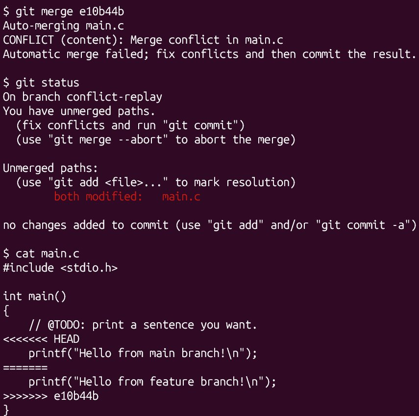

# 计算机系统基础 Lab0 实验报告

姓名：王墨非　　学号：24300750009

仓库：<https://github.com/CommutativeAlgebra/MyLab1>

---

## 一、文档中要求回答的问题

### 1. 你之前有过多人协同开发的经历吗？如果有，你们是使用什么方式分工协作的？

我没有协同开发的经历。

### 2. 思考一下，Git 为什么要设计「暂存-提交」两个步骤？

设计「暂存-提交」便于控制每次具体要提交的内容。

### 3. `git branch` 和 `git branch -a` 的区别是什么？查阅资料并回答。

`git branch` 只列出本地分支，`git branch -a` 列出所有分支。

### 4. 两篇文章概括

**《Git Flow 分支控制》**：「gitflow 使用规范」介绍了 gitflow 这一分支管理规范，分支有 master、develop、feature、release、hotfix，介绍了这些分支在工作时的关系，并给出了使用示例，有使用 Git 按 Gitflow 工作流程工作和使用 Gitflow 扩展库，最后提到了版本号和命名规范。

**《语义化版本 2.0.0》**：「语义化版本 2.0.0」介绍了版本格式和版本递增规则。为了解决版本依赖问题，一种方法是用一组简单的规则及条件来约束版本号的配置和增长。然后给出了具体的版本控制规范和巴科斯范式语法。最后解释了语义化版本控制的好处，以及解答常见问题。

### 5. 为什么要学习 Git

通过这两篇文章可以看出，Git 不只是一个保存代码的工具：Git Flow 说明了多人协作时分支应当如何组织，语义化版本说明了版本号如何表达兼容性。学会 Git 及其配套规范，才能让代码的每一次修改都可读、可追溯、可协作，也是后续实验和实际项目的基础。

## 二、实验步骤

我的实验步骤是先阅读入门手册，配置 Linux 系统，然后在 Linux 装 VS Code，然后按照任务顺序使用 Git，创建仓库，修改代码，提交，merge 并处理冲突，再提交，最后写报告。

具体操作如下：

1. 阅读课程入门手册，确认实验环境要求；
2. 配置 Linux 系统（WSL2 + Ubuntu）；
3. 在 Ubuntu 中安装 Git，用 `git config --global` 配置用户名与邮箱，生成 SSH 密钥并把公钥添加到 GitHub；
4. 在 Ubuntu 中安装并配置 VS Code（Remote-WSL）；
5. 用课程模板仓库创建个人仓库 `MyLab1`，并克隆到本地；
6. 修改 `main.c` 中的 `TODO`，提交并推送到 `main` 分支（提交 `b718acf`）：`git add main.c` → `git commit` → `git push`；
7. 新建 `feature` 分支，在该分支和 `main` 分支上**分别修改 `main.c` 的同一行**并各提交一次：

   ```bash
   git switch -c feature
   git add main.c && git commit -m "feat: change greeting on feature branch"   # e10b44b
   git switch main
   git add main.c && git commit -m "feat: change greeting on main branch"     # e548bf7
   ```

8. 合并 `feature`，处理产生的冲突后再提交（合并提交 `47e1cef`）：

   ```bash
   git merge feature
   # Auto-merging main.c
   # CONFLICT (content): Merge conflict in main.c
   # Automatic merge failed; fix conflicts and then commit the result.
   git add main.c
   git commit -m "merge: resolve conflict between main and feature"
   git push origin main
   git push -u origin feature
   ```

9. 在 `main` 分支提交实验报告。

## 三、截图

**图 1　合并冲突现场**：`git merge` 报出 `CONFLICT (content): Merge conflict in main.c`，`git status` 显示 `both modified: main.c`，`cat main.c` 显示冲突标记 `<<<<<<< HEAD` / `=======` / `>>>>>>> e10b44b`。



解决冲突后（删除冲突标记、保留两边的修改，`git add` 后提交），`git log --oneline --graph --all` 显示的合并完成后的提交历史：

```text
*   47e1cef merge: resolve conflict between main and feature
|\
| * e10b44b feat: change greeting on feature branch
* | e548bf7 feat: change greeting on main branch
|/
* b718acf Initial commit
* 5db4c0f Initial commit
```

合并提交 `47e1cef` 有**两个父提交**（`e548bf7` 与 `e10b44b`），说明冲突已经解决、合并已完成。
